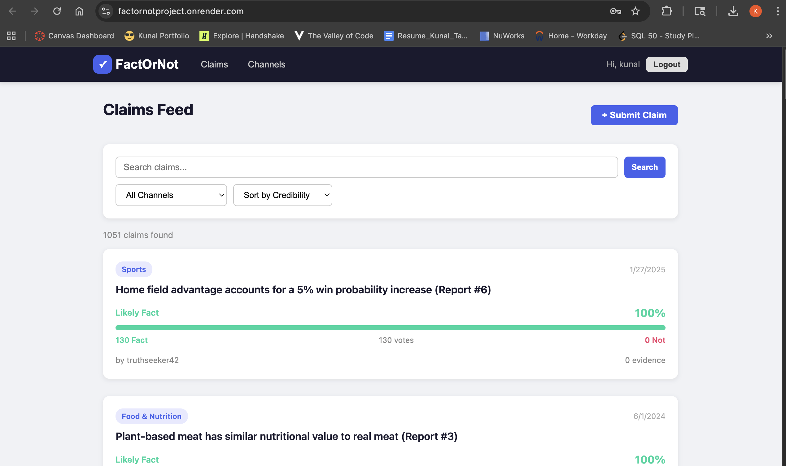

# FactOrNot – Crowdsourced Truth in a World of Noise

### Link 
https://github.com/KunalTakke/FactOrNotProject



## Authors

- **Kunal Takke** – Claims & Verification (Create Claims, View/Browse Claims, Fact/Not Voting, Credibility Score Algorithm, Evidence Comments, Trending Sort, Category Filtering, Claim Editing, Claim Deletion)
- **Kunal Juvvala** – Topics & Channels (Create Topics/Channels, View/Browse Channels, Channel Listing Page, Edit Channels, Delete Channels)

## Class Link 
CS5610 - Web Development
https://northeastern.instructure.com/courses/245751


CS5610 – Web Development, Northeastern University  
Professor John Alexis Guerra Gómez

## Project Objective

FactOrNot is a community-driven fact-checking platform where users submit claims, news headlines, or viral statements, and the community collectively verifies them as "Fact" or "Not." Each submission gets a real-time credibility score based on community votes. Users can add evidence-based comments with source links to support or debunk a claim. Posts are organized under topic channels (Politics, Health, Tech, Science, etc.) so users can browse and verify claims by category.

### Key Features

- **Submit Claims** – Post any headline or statement for community verification
- **Vote Fact or Not** – Cast your verdict on any claim with toggle voting
- **Credibility Meter** – Real-time visual score showing community consensus
- **Evidence Comments** – Add analysis with optional source links to support or debunk
- **Topic Channels** – Browse claims by category (Politics, Health, Tech, Science, etc.)
- **Search & Filter** – Find claims by keyword, channel, or sort by credibility/newest
- **User Authentication** – Register/login with Passport.js local strategy
- **Full CRUD** – Create, read, update, delete on both Claims and Channels
- **1000+ Synthetic Records** – Database pre-seeded with realistic claims across 10 channels

## Tech Stack

- **Frontend:** React 18 (hooks, functional components), PropTypes, CSS modules
- **Backend:** Node.js, Express.js
- **Database:** MongoDB (native driver – no Mongoose)
- **Authentication:** Passport.js with passport-local strategy, bcrypt, express-session
- **Session Store:** connect-mongo

## Instructions to Build

### Prerequisites

- Node.js (v18+)
- MongoDB (running locally on port 27017, or provide a MONGO_URI)

### Setup

1. **Clone the repository**

   ```bash
   git clone <repo-url>
   cd factornot
   ```

2. **Install backend dependencies**

   ```bash
   cd backend
   npm install
   ```

3. **Install frontend dependencies**

   ```bash
   cd ../frontend
   npm install
   ```

4. **Seed the database** (creates 1000+ claims, 10 channels, 21 users)

   ```bash
   cd ../backend
   npm run seed
   ```

5. **Start the backend server**

   ```bash
   npm start
   ```

   Server runs on `http://localhost:3001`

6. **Start the frontend dev server** (in a new terminal)

   ```bash
   cd frontend
   npm start
   ```

   React dev server runs on `http://localhost:3000` with proxy to backend.

### Production Build

```bash
cd frontend
npm run build
cd ../backend
npm start
```

The Express server serves the React build at `http://localhost:3001`.

### Demo Account

- **Username:** `demo`
- **Password:** `demo`

All seeded users use password `password123`.

### Environment Variables (optional)

| Variable         | Default                              | Description             |
| `MONGO_URI`      | `mongodb://localhost:27017/factornot` | MongoDB connection URI  |
| `PORT`           | `3001`                               | Backend server port     |
| `SESSION_SECRET`  | `factornot-secret-key-change-in-prod` | Session encryption key  |

## Mongo Collections

1. **claims** – Stores all submitted claims with votes, credibility scores, and evidence comments
2. **channels** – Stores topic channels for organizing claims by category
3. **users** – Stores registered user accounts with hashed passwords
4. **sessions** – Stores express-session data (managed by connect-mongo)

## Design Decisions

- **No Mongoose** – Uses native MongoDB driver as per project requirements
- **No Axios** – Uses native `fetch` API for all HTTP requests
- **No CORS** – Single-origin setup; Express serves both API and React build
- **Passport-local** – Simple username/password auth with session cookies
- **Anonymous Voting** – Vote data stored per-user but displayed anonymously to reduce bias
- **Credibility Algorithm** – Score = (factVotes / totalVotes) × 100, defaulting to 50 for unvoted claims

## License

[MIT](LICENSE)
